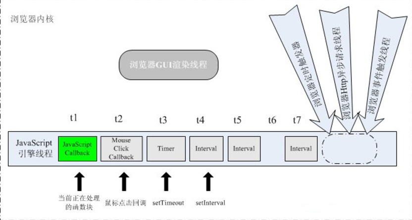
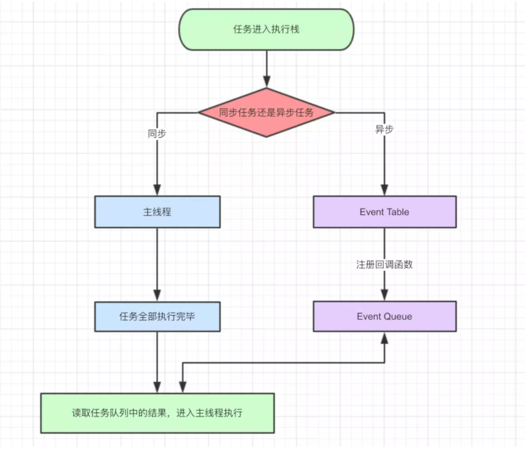
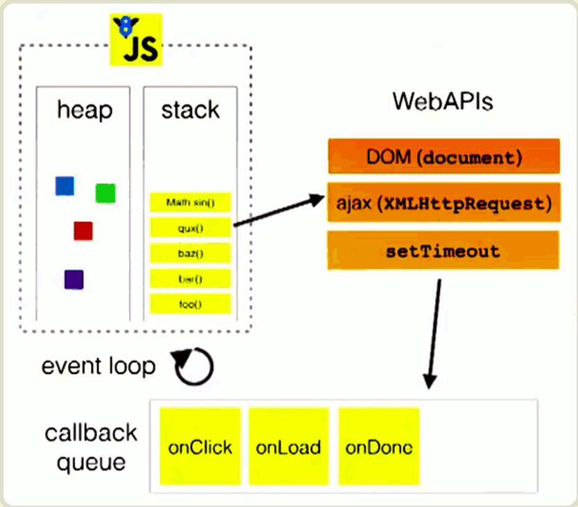

## 类型和语法

### 什么是类型

对语言引擎和开发人员来说,类型是值的内部特征,他定义了值的行为,以使其区别于其他值

#### 内置类型
1. 空值(null)
2. 未定义(undefined)
3. 布尔值(boolean)
4. 数字(number)
5. 字符串(string)
6. 对象(object)
7. 符号(symbol,ES6新增)

### 值

#### 类数组转数组的方法

1. [].prototype.slice.call(this,0)
2. Array.from(类数组)
3. ...运算符(被展开的元素需要有迭代接口)

#### 数字中的"."

"."运算符会被优先识别为数字常量,然后才是对象属性访问运算符

#### null 和 undefined 的区别

null 指空值  ,undefined 指没有值

或者undefined指从未赋值,null指曾赋过值,但是目前没有值

null是一个特殊的关键字,不是标识符,我们不能够将其当作变量来使用和赋值.然而undefined却是一个标识符,可以被当作变量来使用和赋值

在全局下,只有在非严格模式下才能对undefined赋值
在局部,两种模式下都可以对undefined赋值

#### 对象到字符串的的转化

1. 如果对象具有toString()方法,则调用这个方法.如果返回一个原始值,JS将这个值转化为字符串(如果本身不是字符串的话),并返回这个字符串结果

2. 如果对象没有toString()方法,或者这个方法并不返回一个原始值,那么JS会调用valueOf()方法.如果存在这个方法,则JS调用它.如果返回是原始值,JS将这个值转化为字符串(如果本身不是字符串的话),并返回这个字符串结果

3. JS无法从toString()或valueOf()获得到一个原始值,因此这时将抛出一个类型错误异常

## 异步

### JS执行机制

#### 浏览器常驻线程

    1. js引擎线程(解释执行js代码,用户输入,网络请求)

    2. GUI线程(绘制用户界面,与js主线程是互斥的)

    3. http网络请求线程(处理用户的get、post等请求，等返回结果后将回调函数推入任务队列)

    4. 定时触发器线程(setTimeout、setInterval等待时间结束后把执行函数推入任务队列中)

    5. 浏览器事件处理线程(将click、mouse等交互事件发生后将这些事件放入事件队列中)

#### 各线程之间的通信

<!-- 从图中可以看出GUI渲染线程和JS引擎线程之间是互斥的关系,剩下三个线程都是等待完一定是时间后(包括事件触发也可认为是等待了一段时间),将回调函数推入到JS主线程中 -->

#### 浏览器GUI渲染线程和JS引擎线程之间是互斥的原因

GUI渲染线程负责渲染浏览器界面的HTML元素,当界面需要重绘(或者由于某种操作引发重排)时,该线程就会执行. 因为JS脚本是可操纵DOM元素的,当在修改这些元素属性同时渲染界面时, 渲染线程前后获取到的元素数据就可能不一致了,所以在脚本中执行对界面进行更新操作,如添加节点,删除节点或改变节点的外观等更新并不会立即体现出来,这些操作将保存在一个队列中,待JS引擎空闲时才有机会渲染出来

JS是基于单线程运行的,同时又是可以异步执行的,一般来讲这种既是单线程又是异步语言都是基于事件来驱动的,恰好浏览器就提供了一个这样的环境.

事件驱动一般是通过事件循环和事件队列来实现的

由上图可以看出js的执行机制是这样的,首先判断该任务是同步任务还是异步任务,如果是同步任务就进入主线程中,异步任务就进入Event Table并注册回调函数,当指定的事情完成时,Event Table会将这个函数移入Event Queue.主线程内的任务执行完毕为空时,会去Event Queue读取对应的函数,进入主线程执行.上述过程会不断重复,也就是常说的Event Loop(事件循环).

从下边这张图中也可以看出

