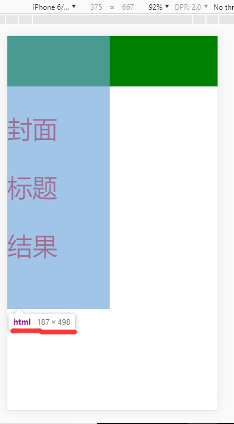

viewport  指的是视口(即可视区窗口)

通过meta标签设置值,使用方式如下:

    <meta name="viewport" content="width=device-width, initial-scale=1.0">

当未设置时

    1. 屏幕的宽度默认为980px，但不同的型号也会不同
    2. 用document.documentElement.clientWidth方法可以获取

在content中可以设置以下这些值

    1. width:控制 viewport 的大小,可以指定的一个值,如 600(不建议使用数字某些安卓设备不支持),或者特殊的值,
        如 device-width 为设备的宽度(单位为缩放为 100% 时的 CSS 的像素).
    2. height:和 width 相对应,指定高度.
    3. initial-scale:初始缩放比例,也即是当页面第一次 load 的时候缩放比例.
    4. maximum-scale:允许用户缩放到的最大比例.
    5. minimum-scale:允许用户缩放到的最小比例.
    6. user-scalable:用户是否可以手动缩放.

#### 当在iphone6/7/8中单独设置了width=device-width(initial-scale=1同样的效果)时出现了两个问题

1. html的宽度变为了375px

    原因:device-width指的是设备的css像素宽度·   

	设置initial-scale就是设置缩放比,缩放比=css像素/viewport宽度  

    这里我们设置为1,由上边公式可以推出viewport=375px

	下边图中html宽度值即为viewport宽度

	

    设置了initial-scale=1这个值之后只是限定了初始的缩放比,设备浏览器还可以进行强制缩放使整个页面都展示出来,如果我们同时设置了maximum-scale=1,minimum-scale=1后将缩放比限定只能是1则设备浏览器也不能够强制缩放(user-scalable=no也可以)

2. 我设置的div的值被缩放了

    原因:移动设备浏览器为了能将整个页面展示出来,自动对整个页面进行了缩放,我们设置了user-scablable=no之后,将不会自动进行缩放

#### 当width与initial-scale同时存在时,会以它们中的最大值为准

#### 既然maximum-scale=1,minimum-scale=1与user-scalable=no有相似的功能,在使用时我们为啥还都要写上？
原因:

1. 会有一些第三方的工具能够破坏user-scalable,比方说一些给父母的手机把文字放大的工具,就会有可能.不过一般是没有问题的
2. 像iphone5下还会有黑边
3. 所以写全了,可以避免一些bug

