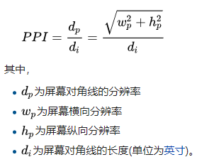

### 尺寸相关概念

1. css像素(设备独立像素,逻辑像素)、

	抽象的概念,单位px(相对单位),由设备像素决定
	PC端 —— 1个css像素 = 1个设备像素 （在100%,未缩放的情况下,如果缩放到200%可以说1个css像素 = 2个设备像素）

	移动端 —— 根据设备不同有很大的差异,根据 ppi 不同我们可以得到不同的换算关系,标准屏幕（160ppi）下 1个设备独立像素 = 1个设备像素

2. 设备像素(物理像素)

	真实像素,顾名思义,显示屏是由一个个物理像素点组成的,通过控制每个像素点的颜色,使屏幕显示出不同的图像,屏幕从工厂出来那天起,它上面的物理像素点就固定不变了,单位pt(绝对单位).

	1pt = 1/72英寸(inch)

	1英寸=2.54厘米

	设备像素在手机中就相当于手机分辨率

3. 屏幕尺寸

	屏幕对角线长度

    屏幕尺寸=屏幕斜边的像素/PPI

4. 像素密度(PPI)

    每英寸上像素(设备像素)的数量

    该值为一个固定的值(每个设备出厂后就不会在变了)

	[可以点击这里查看各设备的相关属性](https://www.sven.de/dpi/)

	

ppi增加n倍，物理像素会增加n*n倍。同时每个物理像素的大小会缩小1/n的平方

5. 像素比(DPR)

    本质: 一个css像素占用几个物理像素

    DPR=物理像素/css像素 
    
    可以通过window.devicePixelRatio获取到DPR

